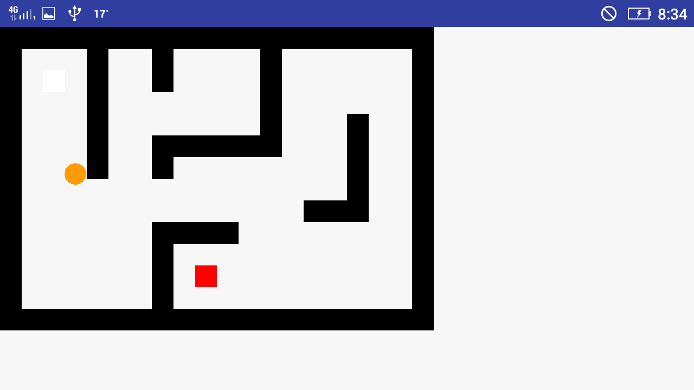

# My Labyrinthe

A little Android app , based on the clasique labyrinth game and on [**OpenClassroom Project**](https://openclassrooms.com/courses/creez-des-applications-pour-android/tp-un-labyrinthe). 

## Screenshots
  


## Functionnality

- You have the control of the ball, move your cellphone for give a direction to the ball, and try to avoid the holes to reach the destination.


## Compatibility

<table>
<tr>
  <th><b>Min. version</b></th>
  <th><b>Targeted version</b></th>
  <th><b>Compiled version</b></th>
  <th><b>Android Studio v. used</b></th>
</tr>
<tr>
  <th>Android 4.4</th>
  <th>Android 5.1</th>
  <th>Android 5.1</th>
  <th>2.2.3</th>
</tr>
</table>

Working on :
- Smartphone
- Tablet

## Installation

- Clone this repository.
```sh
git clone https://github.com/amanda07511/My-labyrinthe
```
- Open the project with [**Android Studio**](https://developer.android.com/studio/index.html)
- Build & run the project.


## Usage

#### Basic usage
- Add a new level by creating a new file .txt, put it on /assets directory then create a new button on MainActivity, then call LabyrintheActivity and send the name of the file.

